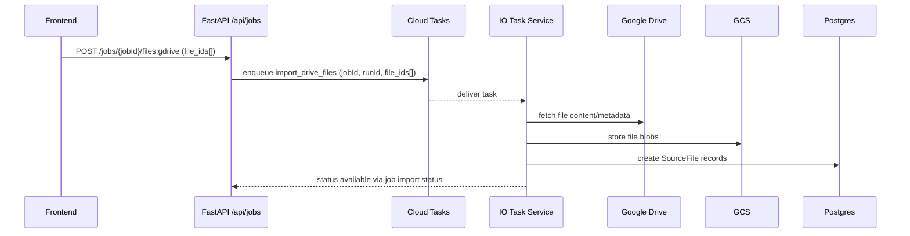
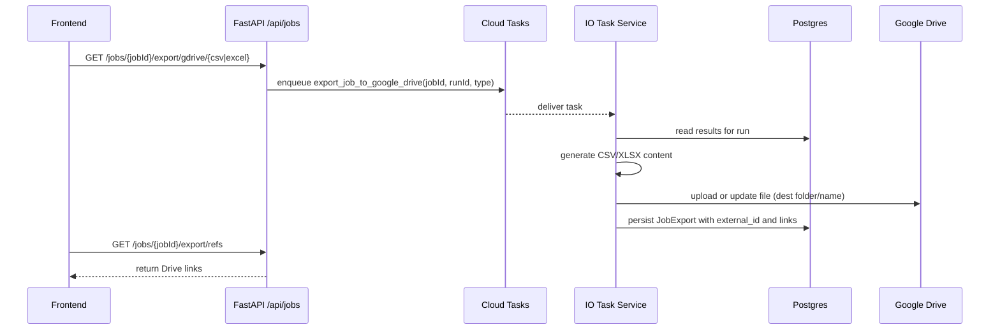
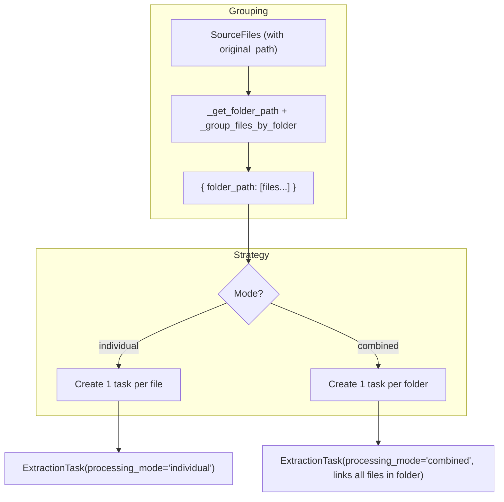

# CPAAutomation

A web platform for extracting structured fields from documents using Google Gemini, with CSV/XLSX exports, Google Drive/Gmail integrations, and automation via Gmail attachment triggers. Built with Next.js (frontend) and FastAPI (backend), using Firebase for authentication, PostgreSQL for persistence, and Google Cloud (Run, Tasks, Scheduler, GCS, Pub/Sub) for infrastructure.

Table of contents
- Overview
- System Architecture
  - Components
  - Architecture Diagram
- Core Workflows
  - Uploads and Imports
  - Extraction Pipeline
  - Exports
  - Automations (Gmail attachments)
  - Folders and Processing Modes
- Notes and Next Steps

## Overview

CPAAutomation lets users define extraction templates composed of fields (name, data type, and an AI prompt) and apply them to documents. Documents can be uploaded from a computer, imported from Google Drive, or ingested automatically from Gmail attachments. The system runs extractions using Google Gemini and produces structured results that can be downloaded as CSV/XLSX or exported to Google Drive. Automations allow continuous, rule-based ingestion and processing.

Key technologies
- Frontend: Next.js, React, Tailwind, shadcn/ui, Firebase Auth client
- Backend: FastAPI, SQLAlchemy/Alembic, Firebase Admin token verification
- AI: Google Gemini via google-genai (Vertex)
- Storage/Infra: Google Cloud Storage, Cloud Run, Cloud Tasks, Cloud Scheduler, Pub/Sub (Gmail push)
- Database: PostgreSQL
- Billing: Stripe (subscriptions and metered usage)
- Types: openapi-typescript generates shared types for lib/api.ts and lib/api-types.ts

## System Architecture

### Components
- Frontend (Next.js)
  - Uses openapi-typescript generated types and a typed client in `lib/api.ts` and `lib/api-types.ts`.
  - In development, `/api/*` is proxied to `http://localhost:8000/api/*`; in production to the deployed FastAPI service.
  - Firebase Auth on the client; sends ID token to backend on protected endpoints.

- Backend API (FastAPI)
  - Endpoints under `/api/*` for jobs, extraction, templates, automations, integrations (Google Drive/Gmail), billing/stripe, and webhooks.
  - Verifies Firebase ID tokens.
  - Persists state in PostgreSQL (SQLAlchemy + Alembic).

- Storage and AI
  - Google Cloud Storage (GCS) stores uploads and artifacts.
  - AI extraction uses Google Gemini (google-genai) with GCS URIs for document inputs.

- Background processing
  - Cloud Run Task services: extract, io, automation, maintenance.
  - Cloud Tasks and Cloud Scheduler orchestrate async and scheduled work.
  - Pub/Sub (Gmail push) to backend webhooks, which enqueue automation processing.

- Billing and usage
  - Stripe for subscriptions and usage reconciliation.
  - Usage events and counters recorded in PostgreSQL.

- Identity and security
  - Firebase Admin SDK verifies tokens server-side.
  - Google OAuth for Drive and Gmail (drive.file scope, Gmail push).

### Architecture Diagram
```mermaid
flowchart LR
    subgraph Client
      U[User (Web)] --> N[Next.js Frontend]
    end

    subgraph Backend
      N -->|/api/*| A[FastAPI API]
      A -->|JWT verify| F[Firebase Admin]
      A -->|SQLAlchemy| P[(PostgreSQL)]
      A -->|files/artifacts| GCS[(Google Cloud Storage)]
      A -->|enqueue tasks| CT[Cloud Tasks]
      A -->|webhooks| WH[Webhook Handlers]
    end

    subgraph Task Services (Cloud Run)
      CT --> T1[Extract Task Service]
      CT --> T2[IO Task Service]
      CT --> T3[Automation Task Service]
      CT --> T4[Maintenance Task Service]
      T1 --> GCS
      T1 --> GEM[Gemini (google-genai)]
      T2 --> GD[Google Drive API]
      T3 --> GM[Gmail API]
      T4 --> STR[Stripe API]
      T4 --> SCHED[Cloud Scheduler]
    end

    subgraph Integrations
      WH <-->|push| PUBSUB[Pub/Sub (Gmail push)]
      A --> STRIPE[Stripe (billing)]
    end
```

## Core Workflows

### Uploads and Imports
This section covers all ingestion paths: direct uploads, Google Drive imports, and Gmail attachments. It also details ZIP handling, page counting, and status reporting.

- Local uploads (files/folders/ZIP)
  - Two supported upload modes:
    1) Direct-to-API (multipart)
       - Endpoint: `POST /api/jobs/{jobId}/files`
       - Body: `multipart/form-data` with `files[]`
       - Behavior:
         - Backend streams content to GCS using `GCSService.upload_file_content`.
         - Creates `SourceFile` rows with `original_filename`, `original_path`, `file_type`, initial `status='uploading'`.
         - ZIP detection triggers an async unpack via IO Task Service (`unpack_zip_file_task`), creating `SourceFile` entries for unpacked files, and excluding the archive file from processing.
         - Page counting occurs from file content using `PageCountingService` (PDF: page count; non-PDF defaults to 1).
       - Response: `{ files: Array<{ id, original_path, ... }>, message }` (simplified for docs; see UI usage).

    2) Direct-to-GCS (pre-signed URLs)
       - Endpoint: `POST /api/jobs/initiate`
       - Request model: `JobInitiateRequest` with `files` containing client paths; server returns normalized paths and signed PUT URLs.
       - Behavior:
         - Backend records planned files for the job run and returns `upload_url` per file (via `GCSService.generate_presigned_put_url`).
         - Client uploads directly to GCS using the signed URL (supports large files and resumability strategies client-side).
         - Page counting is performed after the upload completes (asynchronously), and `SourceFile.page_count` is set when available.
       - Response model: `JobInitiateResponse` including `{ files: [{ original_path, upload_url }...] }` and the job/run IDs.

  - ZIP handling and normalization
    - Archives uploaded via either mode are detected (`file_type` like `application/zip`).
    - IO Task Service unpacks archives (`unpack_zip_file_task`), creates `SourceFile` rows for extracted files, and sets folder-like `original_path` based on the ZIP’s internal structure.
    - The archive `SourceFile` is excluded from extraction workflows; only unpacked files are considered processable.

  - Conversions and page counting
    - DOCX→PDF conversion can run before extraction when enabled via `DocumentConversionService` (LibreOffice headless, timeout configurable).
    - `PageCountingService` counts pages for PDFs (PyPDF2, with PyMuPDF fallback); non-PDF defaults to 1 page. Results are used for usage metering.

  - SourceFile metadata and statuses
    - `SourceFile.original_path` preserves folder structure; used for grouping and processing mode selection.
    - `SourceFile.source_type` indicates origin: `upload` (default), `gdrive`, `gmail`.
    - `SourceFile.status` tracks lifecycle (e.g., `uploading`, `ready`, `failed`); import status endpoint aggregates by status and source.

- Google Drive imports
  - Endpoint: `POST /api/jobs/{jobId}/files:gdrive`
  - Body: `{ "file_ids": string[] }`
  - Behavior:
    - Validates job ownership, then enqueues an IO task via Cloud Run Tasks: `task_type="import_drive_files"` with Drive file IDs.
    - IO Task Service downloads file content using the Drive API, writes to GCS, and creates `SourceFile` rows (`source_type='gdrive'`).
    - `original_path` is inferred from Drive metadata; page counting and conversions apply as with local uploads.
  - Response: `{ success: true, import_task_name, message, file_count }`.

- Gmail attachment imports
  - Manual API:
    - Endpoint: `POST /api/jobs/{jobId}/files:gmail`
    - Body: `{ "attachments": Array<{ messageId, attachmentId, filename }> }` (all fields required per item)
    - Behavior: Enqueues IO task `task_type="import_gmail_attachments"`. IO Task fetches attachments via Gmail API, uploads to GCS, creates `SourceFile` rows (`source_type='gmail'`).
    - Response: `{ success: true, import_task_name, message, attachment_count }`.
  - Automated via Gmail push:
    - See Automations: Gmail push to `/api/webhooks/gmail-push` triggers matching automation(s); resulting import path is identical to the manual flow and produces `SourceFile` entries in the target job/run.

- Import status and file listing
  - Endpoint: `GET /api/jobs/{jobId}/import-status`
  - Behavior: Verifies ownership, queries `SourceFile` rows, and returns counts by `source_type` and `status`, plus a per-file list including size and timestamps.
  - Example response shape:
    - `{ total_files, by_source: { upload, gdrive, gmail }, by_status: { uploading, ready, failed, ... }, files: [{ id, filename, source_type, status, file_size, updated_at }] }`

Mermaid: Drive import flow


### Extraction Pipeline
This section details how we transform files into structured results, including conversion, page counting, schema construction, AI calls, persistence, and metering.

- Field configuration and validation
  - A field consists of: `name` (unique per template), `data_type` (references canonical DataType), and an optional `prompt`.
  - Validation rules (see `AIExtractionService.validate_field_config`):
    - At least one field is required
    - No duplicate field names
    - Prompt length <= 1500 characters

- Preprocessing: conversions and page counting
  - Conversions
    - DOCX→PDF conversion is supported via headless LibreOffice (`DocumentConversionService`).
    - Enabled by default; can be disabled with `DOCX_CONVERSION_ENABLED=false`. Timeout configurable via `DOCX_CONVERSION_TIMEOUT` (default 120s).
    - Flow: download DOCX from GCS → convert locally → upload PDF back to GCS → downstream uses the PDF URI for extraction.
  - Page counting
    - `PageCountingService.count_pages_from_content` counts pages from bytes.
    - PDF: PyPDF2 first, then PyMuPDF fallback, finally temp-file fallback.
    - Non-PDF: assumed 1 page.
    - Stored on `SourceFile.page_count` and used for usage metering.

- Task creation and processing mode
  - Tasks are created per file (individual) or per folder (combined). See “Folders and Processing Modes” for task creation rules and append behaviors.
  - Each task has `processing_mode` ('individual'|'combined') and `result_set_index` (append ordering).

- AI schema construction
  - Individual mode: `AIExtractionService.create_json_schema(fields, data_types_map)` produces a types.Schema for a list of objects.
  - Combined mode: `AIExtractionService.create_combined_json_schema(...)` extends the schema with source attribution fields to map results back to files.
  - The schema encodes field names, types, and structure, ensuring outputs parse as JSON reliably.

- AI calls to Gemini
  - Client: `google-genai` (Vertex integration) initialized with `GOOGLE_CLOUD_PROJECT_ID` and `GOOGLE_CLOUD_LOCATION`.
  - Model: `gemini-2.5-pro` (default).
  - Inputs: list of file parts built from GCS URIs (`types.Part.from_uri(uri, mime_type)`), plus a system prompt derived from field configuration.
  - Individual processing: one file per request; results may be a single object or array of objects.
  - Combined processing: multiple files in one request; returns a unified list; per-document attribution is included for by-document detail.
  - Fallback: if combined processing returns an error or empty data, we log and fall back to individual processing for the same files.

- Persistence
  - An `ExtractionTask` is linked to one or more `SourceFile` records via `SourceFileToTask`.
  - After AI returns data, an `ExtractionResult` row is saved per task with the structured JSON in `extracted_data`.
  - The job run’s status reflects aggregate task states; completed tasks may be preserved in append runs.

- Usage metering and billing
  - For each processed task, we compute total pages by summing `SourceFile.page_count` linked via `SourceFileToTask`.
  - An authoritative `UsageEvent` is created: `{ user_id, task_id, pages, source='extraction_task' }`.
  - `UsageCounter` is updated for the current billing period for fast reads.
  - Maintenance tasks reconcile usage to Stripe and mark events as `stripe_reported` once synced.

- Errors, retries, and observability
  - Cloud Tasks retries failed tasks based on configured backoff; task status transitions to `failed` after exhaustion.
  - We persist errors in task/result metadata where available; a task may be partially successful (e.g., combined mode with some empty documents).
  - Logs include model name, file counts, and key identifiers; use Cloud Logging to correlate API and task logs.

Mermaid: file extraction
```mermaid
sequenceDiagram
  participant EX as Extract Task Service
  participant GCS as GCS
  participant GEM as Gemini (google-genai)
  participant DB as Postgres

  EX->>DB: read JobRun + SourceFiles
  EX->>EX: build JSON schema from FieldConfig/DataTypes
  EX->>GCS: construct gs:// URIs for files
  EX->>GEM: request(model=gemini-2.5-pro, schema, gs:// URIs)
  GEM-->>EX: structured JSON results
  EX->>DB: write ExtractionTask/ExtractionResult, update statuses
  EX->>DB: record UsageEvent; update UsageCounter
```

### Exports
This section details CSV/XLSX generation, large result handling, Drive export semantics, and idempotent export references.

- Download (CSV/XLSX)
  - Endpoints
    - CSV: `GET /api/jobs/{jobId}/export/csv?run_id=...`
    - Excel: `GET /api/jobs/{jobId}/export/excel?run_id=...`
  - Content generation
    - CSV: `export_service.generate_csv_content(results_response)`
    - Excel: `export_service.generate_excel_content(results_response)` using openpyxl
  - Unified schema
    - We construct a unified column list across all results in the run, preserving the first-seen order.
    - A leading column "Source File Path(s)" is always included to show provenance for each row.
    - For result arrays, values map from the local result's `columns` array; missing values become empty strings so a rectangular table is guaranteed.
  - Filenames
    - Server sets Content-Disposition to a safe filename generated by `generate_export_filename(job_name, timestamp, ext)`; e.g. `my_job_20250130_142355Z.csv`.
  - Large result considerations
    - CSV streaming writes header + rows incrementally in memory; for very large runs consider Drive export to avoid browser memory constraints.
    - Excel is held in memory before returning; large runs may be better exported to Drive.

- Google Drive export (async)
  - Endpoints (enqueue tasks)
    - CSV: `GET /api/jobs/{jobId}/export/gdrive/csv?run_id=...&folder_id=...`
    - Excel: `GET /api/jobs/{jobId}/export/gdrive/excel?run_id=...&folder_id=...`
  - Behavior
    - Verifies job ownership, then enqueues a Cloud Run Task `enqueue_export_task(jobId, userId, file_type, folder_id, run_id)`.
    - IO/Task Service fetches results, generates CSV/XLSX using the same helpers, and uploads to Drive.
    - Upsert semantics: exporter may create or update a Drive file in the target folder; resulting file ID and links are recorded.
  - Export references
    - Canonical refs stored in `job_exports` include `external_id` (Drive file ID), `file_type` (csv|xlsx), dest `gdrive`, and status.
    - Fetch canonical links with `GET /api/jobs/{jobId}/runs/{runId}/export-refs` which returns webView/webContent links per file type when available.
  - Idempotency and repeat exports
    - Re-invoking export for the same run/type updates the canonical Drive file (same external_id) rather than creating duplicates when possible.
    - This keeps links stable for downstream consumers.

Mermaid: export to Google Drive


### Automations (Gmail attachments trigger)
This section explains configuration, matching, Gmail push/watch lifecycle, idempotency, and error handling for automations.

- Configuration
  - Users define an Automation with:
    - `trigger_type = 'gmail_attachment'`
    - `trigger_config`: Gmail search query (e.g., `from:supplier@domain.com has:attachment newer_than:7d`)
    - `job_id` (target job), `processing_mode` (`individual`|`combined`), `append_results` (bool)
    - Optional export config: `dest_type='gdrive'` with `file_type` and `folder_id`
  - Editing an automation updates stored `processing_mode` and `append_results` applied to each run.

- Central mailbox model
  - Public alias: `document@cpaautomation.ai` forwards to the actual central mailbox.
  - Gmail API access uses a service account; mailbox is watched via Gmail Pub/Sub.
  - Pub/Sub topic/subscription/webhook are configured by `gmail_subscription_service` using env vars:
    - `GMAIL_PUBSUB_TOPIC`, `GMAIL_PUBSUB_SUBSCRIPTION`, `GMAIL_WEBHOOK_URL`, `GOOGLE_CLOUD_PROJECT_ID`.

- Gmail push and watch lifecycle
  - Push destination: `/api/webhooks/gmail-push` (POST). Verification supported via GET.
  - `gmail_pubsub_service.process_push_notification` decodes the push and logs basic info.
  - `process_history_with_cursor(db)` fetches changes since last `historyId` and returns parsed messages, handling pagination.
  - Watch renewal: Cloud Scheduler periodically calls a maintenance task to renew the Gmail watch before the 7‑day expiry.

- Matching and triggering
  - For each parsed message, we extract: sender, subject, body, attachments (name, id, mime).
  - We map the sender to a user (if needed) and then select automations where the Gmail query matches; filters are evaluated using Gmail API search semantics.
  - For each matching automation:
    - Create a job run if needed, copying previous results when `append_results=true`.
    - Create extraction tasks using the automation’s `processing_mode` (individual or combined).
    - Enqueue imports for all attachments (IO task: `import_gmail_attachments`) followed by extraction and optional export.
  - The actual trigger is enqueued via Cloud Run Tasks (`enqueue_automation_task`), ensuring async processing and retries.

- Idempotency and cursoring
  - We maintain a mailbox history cursor; only new `historyId` deltas are processed.
  - If a 404 occurs for an old cursor, `_recover_from_404` performs a full sync (limited window) and resets watch.
  - Import workers de-duplicate attachments per message ID and filename when creating `SourceFile` rows to avoid duplicates.

- Error handling and observability
  - Webhook auth in development accepts localhost or a `GMAIL_PUBSUB_DEV_TOKEN`; production should enforce Google-signed JWT verification.
  - Failures in import/extraction/export paths are retried by Cloud Tasks; permanent errors are logged and surfaced in job run status.
  - Logs include `user_id`, task names, and Gmail `messageId`s for traceability across webhook → automation task → IO → extraction.

Mermaid: automation trigger flow
```mermaid
sequenceDiagram
  participant GM as Gmail
  participant PUB as Pub/Sub
  participant WH as FastAPI /api/webhooks/gmail-push
  participant DB as Postgres
  participant CT as Cloud Tasks
  participant AUTO as Automation Task Service
  participant IO as IO Task Service
  participant EX as Extract Task Service

  GM-->>PUB: push notification
  PUB-->>WH: HTTP push body
  WH->>DB: process_history_with_cursor(); find new messages
  WH->>DB: find automations with trigger_type=gmail_attachment
  WH->>CT: enqueue automation processing (per matched email)
  CT-->>AUTO: deliver automation task
  AUTO->>CT: enqueue import_gmail_attachments (job/run)
  CT-->>IO: deliver import task
  IO->>DB: create SourceFiles; store blobs in GCS
  IO->>CT: enqueue extraction for run
  CT-->>EX: deliver extract task
  EX->>DB: write results, usage
  EX->>CT: enqueue optional export
```

### Folders and Processing Modes
- Source file paths
  - Each file keeps an `original_path` (and `original_filename`) to preserve folder structure for grouping.
  - ZIPs are unpacked by the IO Task Service; unpacked files inherit archive paths.
  - Drive/Gmail imports populate `original_path` based on available filename/path context.

- Folder extraction strategies
  - Individual mode
    - One `ExtractionTask` per file with `processing_mode='individual'`.
    - Uses `AIExtractionService.extract_data_individual` (one file per Gemini request with the configured schema).
    - Exports include a “Source File Path(s)” column containing that file’s path.
  - Combined mode
    - Files are grouped by folder; a single `ExtractionTask` is created per folder with `processing_mode='combined'`.
    - Uses `AIExtractionService.extract_data_combined` (multiple files per Gemini request with a combined schema that includes source attribution).
    - The combined task links to all files in the folder; exported rows include the set of contributing source paths.
    - Fallback: If combined processing fails, the system falls back to individual processing for those files.

- How folders are determined
  - `_get_folder_path(original_path)` extracts the folder portion; `_group_files_by_folder` builds `{ folder_path: [files...] }`.
  - Nested handling for overrides: a mapping entry applies to `folder_path == target_path` or `folder_path` starting with `target_path + '/'`.

- Per-folder processing mode overrides (manual jobs)
  - The frontend can send `processing_modes` with job field updates: `{ "folder/path": "individual" | "combined", ... }`.
  - For each entry, the service creates tasks accordingly:
    - `individual`: one task per file.
    - `combined`: one task for the entire folder.
  - Result sets: The service sets `result_set_index` to keep ordering consistent, particularly in append mode.

- Automation-level processing mode
  - Automations store a single `processing_mode` (default `'individual'`) that is applied when creating tasks per run.
  - Combined mode groups files by folder at automation time; one task per folder.

- Append mode and result sets
  - `append_results=true` on a job run copies completed tasks/results from the previous run and sets `append_from_run_id`.
  - New tasks get a higher `result_set_index` so appended results appear after original results.
  - In fresh runs (non-append), previously completed tasks are removed so the run reprocesses with the current configuration.

- Exports and folder context
  - CSV/XLSX include a unified set of columns across results and always include “Source File Path(s)”.
  - Individual rows contain a single path; combined rows include merged paths for that folder task.

Mermaid: folder grouping and task creation


## Notes and Next Steps
- The README currently covers: Overview, System Architecture, Core Workflows (including folder handling and processing modes).
- Upcoming sections (to be added next):
  - Local Development (prereqs, env vars, migrations, scripts)
  - Deployment and Operations (Cloud Run, Tasks, Scheduler, Pub/Sub, GCS, OAuth, Stripe)
  - Security and Data Management (Firebase Auth, IAM scopes, lifecycle)
  - Reference (models, APIs, configuration, glossary, FAQ)

If you have edits to phrasing or want more detail in any diagram, let me know and I’ll update before we continue.
