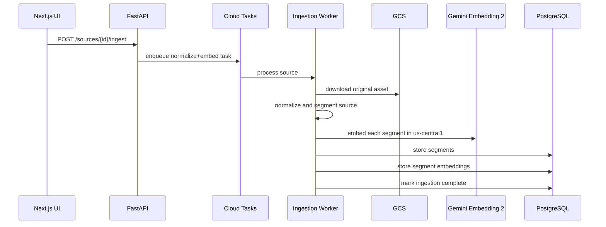
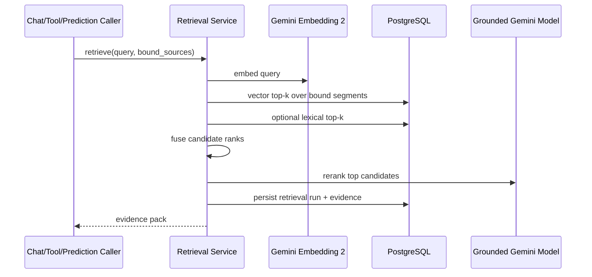

# Inkwise Design: Gemini Embedding 2, No PageIndex

This document defines the target Inkwise retrieval architecture after PageIndex is completely removed and replaced with Gemini Embedding 2 through Vertex AI.

It is the successor design to `docs/INKWISE_PAGEINDEX.md`, which describes the current PageIndex-shaped implementation.

## Executive Summary

Inkwise should move from its current PageIndex-derived, FTS-first retrieval system to a Gemini Embedding 2-based vector RAG system with these properties:

- PageIndex is removed from the codebase, build, runtime, and schema.
- Retrieval is primarily vector-based, with optional lexical fusion for robustness.
- Sources become modality-aware retrieval segments rather than PageIndex tree nodes.
- Gemini Embedding 2 is used as the single embedding model across text, PDF, image, webpage-rendered PDF, and future audio/video references.
- Postgres remains the system of record, and pgvector becomes the vector store.
- Existing Inkwise product surfaces continue to work: source ingestion, source binding, grounded chat, inline writing tools, and future grounded predictive writing.

The key architectural idea is to replace "tree generation + node/page FTS retrieval" with "normalize -> segment -> embed -> vector retrieve -> rerank -> evidence pack".

## Why We Are Replacing PageIndex

The current design has three core issues:

1. It is not actually using hosted PageIndex retrieval; it only vendors PageIndex OSS for tree generation.
2. Retrieval quality depends heavily on English full-text search and LLM query rewriting.
3. The current architecture is tightly optimized for PDF tree navigation rather than multimodal, vector-based retrieval across PDFs, DOCX, webpages, images, and future media.

Inkwise needs a retrieval substrate that can support:

- multimodal references
- semantic search rather than mostly lexical search
- evidence-backed chat and writing tools
- future citation bubbles and richer evidence UX
- future predictive writing grounded to references

Gemini Embedding 2 is the right fit because it places text, PDF, image, audio, and video inputs into a shared semantic space.

## Relevant Gemini Embedding 2 Constraints

Based on `docs/gemini/GEMINI_EMBEDDING_2.md` and `docs/gemini/GET_MULTIMODAL_EMBEDDINGS.md`:

- Model ID: `gemini-embedding-2-preview`
- Region support: `us-central1` only
- Launch stage: public preview / Pre-GA
- Default output size: 3072 dimensions
- Configurable output size: 128 to 3072 dimensions
- Recommended lower dimensions: 128, 768, 1536
- Max text sequence length: 8192 tokens
- PDF support: 1 file per prompt, up to 6 pages per file
- Image support: up to 6 images per prompt
- Audio support: 1 file per prompt, up to 80 seconds
- Video support: 1 file per prompt, up to 80 seconds with audio or 120 seconds without audio
- Document OCR is supported internally by the model
- Similarity scores should be used for ranking, not fixed-threshold decisions

Important product implication: Google notes that text-only use cases may be better served by the text-embeddings API, but Inkwise should still standardize on Gemini Embedding 2 because multimodal references are a core product requirement. To control storage and latency, we will use a lower-dimensional production index.

## Goals

- Remove PageIndex completely from Inkwise.
- Implement vector-based retrieval using Gemini Embedding 2.
- Support multimodal source ingestion with a single retrieval interface.
- Preserve source binding, retrieval runs, and evidence-backed responses.
- Keep Postgres as the canonical data store.
- Make the design extensible for later patent features, especially citation bubbles and grounded predictive writing.

## Non-Goals

- This document does not define the full patent feature set; that belongs in `INKWISE_PATENT_FEATURES.md`.
- This document does not define the final patent UI; that belongs in `INKWISE_PATENT_UI.md`.
- This document does not require introducing Vertex AI Vector Search; the initial design uses Postgres + pgvector.

## Target Architecture

### High-level flow

### Design principles

- Use one embedding model for all retrieval modalities.
- Keep retrieval units small enough for precise evidence, but large enough to preserve local context.
- Store immutable normalized artifacts for replay, reindexing, and auditability.
- Treat evidence as a first-class object with stable locators and preview metadata.
- Favor ranking pipelines over threshold-based allow/deny logic.

## Source Normalization Model

PageIndex currently turns PDFs into a tree. The new system instead turns every source into one or more normalized retrieval assets and segments.

### Core concept: source segment

A source segment is the smallest retrievable evidence unit. Every segment has:

- a `source_id`
- an `ingestion_id`
- a modality
- a locator
- an embedding
- optional extracted text
- optional preview artifact

Examples:

- PDF pages 5-8 window
- DOCX paragraphs 14-22
- webpage article section with DOM anchor
- image asset
- audio clip from 120s to 160s
- video clip from 30s to 50s

### Normalization by source type

#### PDF

Store:

- original PDF in GCS
- extracted plain text where available
- optional page preview images or thumbnails
- Gemini-embedding-ready PDF window assets of <= 6 pages

Create segments:

- `pdf_window` segments for semantic recall
- `text_chunk` segments for precise evidence and lexical fusion

Recommended PDF segmentation:

- `pdf_window`: 4-page windows with 1-page overlap
- `text_chunk`: page-scoped or paragraph-scoped chunks capped well below 8192 tokens

Rationale:

- PDF windows preserve layout, tables, figures, and scanned content for multimodal search
- text chunks produce cleaner excerpts and better evidence precision

#### DOCX

Normalize DOCX into two representations:

- a canonical PDF generated from DOCX for layout-preserving retrieval
- extracted text blocks / paragraphs for precise evidence

Then ingest it like a PDF-backed source:

- `pdf_window` segments from the generated PDF
- `text_chunk` segments from extracted document structure

#### Webpage

Normalize webpages into immutable snapshots:

- raw HTML snapshot
- readability-cleaned text snapshot
- rendered PDF snapshot or page screenshots

Create segments:

- `web_block` text segments from cleaned DOM sections
- `pdf_window` or `image` segments from rendered output when visual structure matters

The critical rule is that retrieval must operate on an immutable captured snapshot, not a live URL that can drift.

#### Image

Store:

- original image
- optional OCR text if extracted by a separate text-extraction step
- thumbnail preview

Create segments:

- one `image` segment per image asset
- optional `text_chunk` sidecars if OCR or captions are available

#### Audio / Video

These are not required for the first implementation pass, but the design should support them cleanly.

Create segments:

- `audio_clip` or `video_clip` time windows that satisfy Gemini Embedding 2 input limits
- optional transcript-based `text_chunk` sidecars when transcripts are available

## Chosen Embedding Strategy

### Model

- `gemini-embedding-2-preview`

### Production dimensionality

- Default production index: `1536`
- Offline evaluation / experimentation: optionally `3072`

Rationale:

- 1536 is one of Google's recommended lower dimensions
- it cuts storage roughly in half compared with 3072
- it should improve latency while preserving retrieval quality for most Inkwise use cases

### Query and document embedding policy

- Query embeddings are generated from the user's search/chat/tool query text.
- Segment embeddings are generated from the normalized source segment in its native modality when possible.
- We will use paired task instructions for query and document embeddings to optimize retrieval behavior.

Note: the docs mention custom task instructions but only provide examples, not a finalized Inkwise-specific string set. Exact task-instruction strings should be validated during implementation and kept configurable.

## Vector Store Choice

### Primary choice: pgvector in Postgres

Inkwise already depends on PostgreSQL. The simplest architecture is to keep Postgres as both:

- system of record
- vector store

This avoids introducing another managed search service before we prove retrieval quality.

### Required database capability

Enable `pgvector` in the Inkwise database and index active embeddings with cosine distance.

Recommended indexing approach:

- `vector(1536)` column for active embeddings
- HNSW index using cosine distance ops

We should also retain standard B-tree indexes for:

- `user_id`
- `source_id`
- `segment_type`
- `ingestion_id`

### Why not Vertex AI Vector Search first

We do not need a separate vector database yet because:

- Inkwise already has Postgres
- the current product scale is likely manageable in Postgres
- we need strong transactional linkage between sources, segments, evidence, and retrieval runs
- pgvector keeps local development and Cloud Run deployment simpler

If future scale requires it, we can add a separate vector store later behind the same retrieval interface.

## Proposed Data Model

### Keep

These entities remain conceptually valid:

- `InkwiseDocument`
- `InkwiseSource`
- `InkwiseDocumentSourceBinding`
- `InkwiseSourceIngestion` (repurposed)
- `InkwiseChatThread`
- `InkwiseChatMessage`
- `InkwiseRetrievalRun`
- `InkwiseRetrievalEvidence`
- templates tables

### Remove

These PageIndex-specific artifacts should be deleted after migration:

- `InkwiseSourceTreeNode`
- `backend/inkwise/services/pageindex_oss_treegen.py`
- vendored runtime dependency on `vendor/pageindex`
- `pageindex_doc_id`
- `tree_gcs_bucket`
- `tree_gcs_object`
- `tree_cached_at`
- `doc_description`
- `treegen_engine="pageindex_oss"` assumptions

### New tables

#### `inkwise_source_segments`

Represents retrievable content units.

Suggested fields:

- `id`
- `source_id`
- `ingestion_id`
- `user_id`
- `segment_type` (`pdf_window`, `text_chunk`, `image`, `web_block`, `audio_clip`, `video_clip`)
- `modality` (`pdf`, `text`, `image`, `web`, `audio`, `video`)
- `order_index`
- `title`
- `text_content` nullable
- `text_tsv` computed nullable
- `char_count`
- `token_count`
- `page_start` nullable
- `page_end` nullable
- `time_start_ms` nullable
- `time_end_ms` nullable
- `locator_json`
- `asset_bucket` nullable
- `asset_object` nullable
- `preview_bucket` nullable
- `preview_object` nullable
- `meta_json`
- `created_at`

#### `inkwise_source_segment_embeddings`

Stores embeddings separately so we can reindex without rewriting segments.

Suggested fields:

- `id`
- `segment_id`
- `source_id`
- `user_id`
- `model`
- `embedding_dimension`
- `task_instruction`
- `is_active`
- `embedding vector(1536)`
- `created_at`

### Changes to `inkwise_source_ingestions`

Repurpose ingestion metadata away from PageIndex and toward normalization/embedding runs.

Suggested additions/replacements:

- `pipeline` values such as `normalize_embed`
- `normalizer_version`
- `embedding_model`
- `embedding_dimension`
- `embedding_location`
- `segment_count`
- `preview_manifest_bucket` / `preview_manifest_object`
- `error_json`

`InkwiseSourceIngestion` should track the full lifecycle of source processing, not tree generation.

### Changes to `inkwise_retrieval_evidence`

Replace tree-specific evidence linkage with segment-specific evidence linkage.

Suggested fields:

- keep `retrieval_run_id`, `evidence_id`, `source_id`, `excerpt`, `score`
- add `segment_id`
- add `locator_json`
- add `preview_bucket` / `preview_object` or preview URL metadata
- deprecate `node_id` and `node_title`

## Ingestion Pipeline

### New ingestion stages

1. Validate source and source type
2. Normalize source into canonical assets
3. Extract text where possible
4. Build source segments
5. Generate embeddings for each segment
6. Store segments and embeddings
7. Mark source as ready for grounding

### Ingestion sequence

### Rate limiting and retries

Because Gemini Embedding 2 is preview, region-limited, and quota-bound:

- embedding generation must run in background tasks, not request threads
- workers should process segments in bounded concurrency
- ingestion must be idempotent by `ingestion_id`
- failed segments should be retriable without duplicating completed ones

## Retrieval Pipeline

### Retrieval inputs

- current query text
- current user ID
- current document ID
- bound source IDs
- optional chat history
- optional draft selection text

### Retrieval algorithm

#### Step 1: query preprocessing

- Normalize the query text
- Optionally retain the existing query rewrite step for chat/tool scenarios
- Generate a Gemini Embedding 2 query vector

#### Step 2: vector recall

Search `inkwise_source_segment_embeddings` scoped to:

- the current user
- active embeddings only
- the bound source IDs

Return the top `N` candidates by cosine similarity.

#### Step 3: optional lexical fusion

Keep a lightweight lexical path for robustness:

- FTS over `inkwise_source_segments.text_tsv`
- fuse vector and lexical ranks with reciprocal rank fusion or a similar rank-based method

Rationale:

- vector retrieval handles semantic matches
- lexical retrieval helps exact terms, citations, clause numbers, and proper nouns

#### Step 4: reranking

Rerank the top candidate set with a Gemini generation model using:

- the user query
- candidate title / locator metadata
- candidate excerpt text

Reranking selects the final evidence set and improves precision.

#### Step 5: evidence packing

Build a final evidence pack of 6-12 items with:

- `evidence_id`
- `source_title`
- `segment_id`
- locator metadata
- excerpt text when available
- preview metadata for multimodal evidence

### Retrieval sequence

## Evidence and Citation Design

The new retrieval system must support future citation bubbles, so evidence objects need richer locators than the current `page_number + node_title` structure.

### Evidence locator format

Each evidence item should include a `locator_json` with modality-specific fields.

Examples:

- PDF / DOCX-as-PDF: `{ "kind": "page_range", "page_start": 5, "page_end": 6 }`
- webpage: `{ "kind": "dom_anchor", "selector": "article > h2:nth-of-type(3)", "url": "..." }`
- image: `{ "kind": "image_asset" }`
- audio: `{ "kind": "time_range", "start_ms": 120000, "end_ms": 145000 }`
- video: `{ "kind": "time_range", "start_ms": 30000, "end_ms": 50000 }`

### Evidence preview strategy

Every evidence item should optionally carry preview metadata so the UI can show the source directly:

- PDF page thumbnail or preview link
- webpage screenshot or rendered preview
- image thumbnail
- audio/video timestamp and preview asset

This is how the future citation bubble UX will be grounded in real retrieval artifacts.

## API Design Impact

### APIs that should remain conceptually the same

- `POST /api/inkwise/sources/{source_id}/ingest`
- `GET /api/inkwise/documents/{document_id}/sources`
- `POST /api/inkwise/documents/{document_id}/retrieval:run`
- grounded chat and writing-tools routes

### Readiness semantics change

Today a source is grounding-ready when:

- ingestion completed
- pages exist
- tree nodes exist

After migration, a source is grounding-ready when:

- the latest ingestion completed
- at least one active retrieval segment exists
- at least one active embedding row exists

### Retrieval response changes

Additions:

- `segment_id`
- `locator`
- `preview`

Removals / deprecations:

- `node_id`
- `node_title`

## Product Surface Integration

### Grounded chat

Grounded chat continues to work as it does today, except retrieval is now vector-based.

The chat route should:

- embed the question
- retrieve evidence from bound sources
- build an evidence pack
- call the grounded generation model
- persist citations against `segment_id` + `locator_json`

### Inline writing tools

Inline writing tools should call the same retrieval pipeline, but with a query assembled from:

- user instruction
- selection text
- surrounding text

The result remains an evidence-backed rewrite.

### Predictive writing

The current prediction path is ungrounded. After this migration, the retrieval service will be capable of supporting grounded predictive writing by using:

- preceding text
- optional current block text
- bound references

That feature is defined later, but this retrieval design is built to support it.

## Settings and Service Changes

### New settings

Add Inkwise settings for embeddings, separate from generation settings:

- `INKWISE_EMBEDDING_MODEL=gemini-embedding-2-preview`
- `INKWISE_EMBEDDING_LOCATION=us-central1`
- `INKWISE_EMBEDDING_DIMENSION=1536`
- `INKWISE_EMBEDDING_TASK_QUERY=...`
- `INKWISE_EMBEDDING_TASK_DOCUMENT=...`
- `INKWISE_VECTOR_SEARCH_TOP_K=...`
- `INKWISE_RERANK_TOP_K=...`

### New backend services

Add:

- `backend/inkwise/services/embeddings.py`
  - Gemini Embedding 2 wrapper
- `backend/inkwise/services/source_normalizer.py`
  - source-type-specific normalization
- `backend/inkwise/services/segmentation_service.py`
  - builds retrieval segments
- `backend/inkwise/services/vector_retrieval_service.py`
  - pgvector retrieval + fusion + rerank

Update:

- `backend/inkwise/services/ingestion_service.py`
- `backend/inkwise/services/document_sources.py`
- `backend/inkwise/services/retrieval_service.py`
- chat and writing-tool routes

Delete:

- `backend/inkwise/services/pageindex_oss_treegen.py`
- PageIndex runtime references from requirements / Docker / build config

## Migration Plan

### Phase 1: schema and service scaffolding

- Add pgvector extension and new segment tables
- Add Gemini embedding service wrapper
- Add source normalization + segmentation services
- Keep current PageIndex pipeline intact during development

### Phase 2: dual ingestion in development/staging

- Ingest sources into the new segment/embedding pipeline behind a feature flag
- Compare retrieval quality against the current pipeline
- Validate costs, latency, and quota behavior

### Phase 3: switch read path

- Move retrieval routes, chat, and writing tools to the vector pipeline
- Stop using tree nodes in runtime retrieval
- Mark PageIndex code path deprecated

### Phase 4: backfill and cleanup

- Re-ingest existing Inkwise sources into the new segment/embedding format
- Remove PageIndex code and vendor dependency
- Drop old PageIndex-specific columns and tables after successful cutover

## Operational Considerations

### Region constraint

Gemini Embedding 2 is only available in `us-central1`, so embedding requests must be pinned there even if generation models remain configurable elsewhere.

### Preview risk

Because Gemini Embedding 2 is Pre-GA:

- all embedding behavior should be isolated behind a single service wrapper
- model name, dimensionality, and task instructions must be configurable
- ingestion should record model/version metadata for reindexing

### Storage cost

Using 1536-dim vectors plus preview assets is a meaningful storage addition. The design mitigates this by:

- using lower-dimensional embeddings by default
- storing embeddings separately from segment text
- keeping segment counts bounded by deterministic segmentation rules

### Similarity handling

We should not use a fixed relevance threshold. Instead:

- retrieve top-k
- rerank
- always allow the generation layer to declare evidence insufficient when needed

## Open Questions To Resolve During Implementation

1. Exact task-instruction strings for query/document embeddings.
2. Final segmentation defaults for PDFs: 4-page windows vs 6-page windows, and chunk overlap tuning.
3. Whether to ship lexical fusion in the first cut or after initial vector-only evaluation.
4. Whether scanned PDFs need an additional OCR text path for better excerpt display, even though embeddings can use PDF OCR internally.
5. Whether webpage ingestion should prioritize HTML blocks, rendered PDF windows, or both in the first release.

## Final Target State

When this design is implemented, Inkwise will be a PageIndex-free retrieval system with:

- Gemini Embedding 2 for vector retrieval across modalities
- Postgres + pgvector as the vector store
- normalized multimodal source segments instead of PageIndex trees
- evidence objects with stable locators and preview metadata
- a retrieval engine that supports grounded chat, grounded writing tools, and future grounded predictive writing

In short, the architecture changes from:

- `PDF -> PageIndex tree -> FTS over nodes/pages -> evidence`

to:

- `source -> normalized segments -> Gemini embeddings -> vector retrieval -> reranked evidence`
