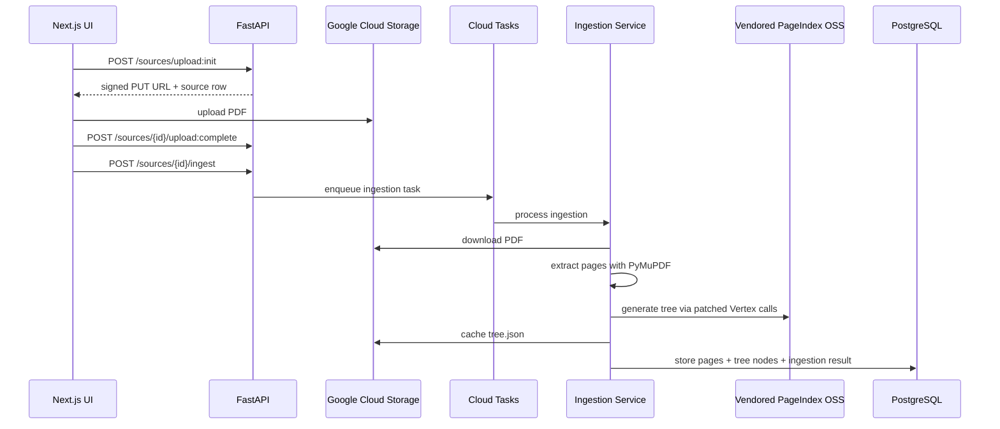
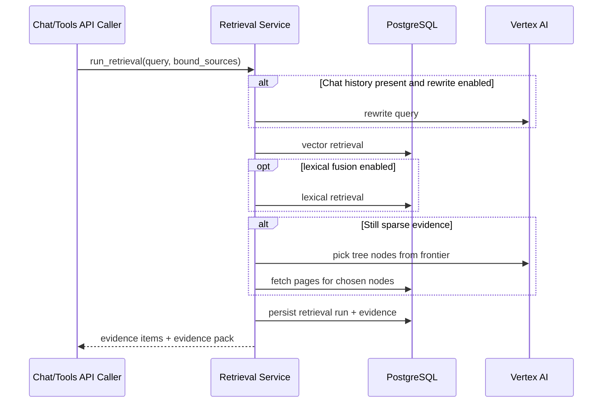

# Inkwise Current Implementation (PageIndex-Based)

This document is a historical snapshot of Inkwise before the Gemini Embedding 2 migration. PageIndex runtime code and the vendored `vendor/pageindex` repository were removed during the Phase 8 cleanup, but this doc is retained to describe the pre-migration architecture.

## Executive Summary

Inkwise is already implemented as a functional module with:

- A Next.js UI under `app/dashboard/inkwise`
- A FastAPI backend mounted at `/api/inkwise`
- PostgreSQL persistence for documents, sources, retrieval runs, chat, and templates
- GCS-backed source storage
- Vertex AI generation for chat, writing tools, autocomplete, query rewriting, and tree search
- A PageIndex-derived ingestion pipeline that generates hierarchical source trees from PDFs

Important nuance: Inkwise does not currently use the hosted PageIndex APIs for retrieval or chat. Instead, it vendors the PageIndex OSS code in `vendor/pageindex`, patches its LLM hooks to call Vertex AI, uses it to generate a tree, and then performs retrieval locally from Postgres using full-text search plus LLM-assisted query rewrite and tree traversal.

## Main Code Locations

- Backend router: `backend/inkwise/router.py`
- Backend models: `backend/models/inkwise_models.py`
- Inkwise migration: `backend/alembic/versions/010_inkwise_module_schema.py`
- Source upload/storage: `backend/inkwise/services/source_service.py`
- Source ingestion: `backend/inkwise/services/ingestion_service.py`
- PageIndex tree generation patch: `backend/inkwise/services/pageindex_oss_treegen.py`
- Retrieval pipeline: `backend/inkwise/services/retrieval_service.py`
- Grounded chat: `backend/inkwise/routes/chat.py`, `backend/inkwise/services/chat_service.py`
- Writing tools and autocomplete: `backend/inkwise/routes/writing_tools.py`, `backend/inkwise/services/writing_tools_service.py`
- Frontend workspace: `app/dashboard/inkwise/write/[id]/page.tsx`
- Frontend references page: `app/dashboard/inkwise/references/page.tsx`
- Frontend editor and inline tools: `components/inkwise/inkwise-editor.tsx`, `components/inkwise/inline-writing-tools.tsx`
- Vendored PageIndex docs/code: `vendor/pageindex`

## Current Architecture

### Backend

The Inkwise backend is mounted from `backend/main.py` and grouped in `backend/inkwise/router.py`. The router still exposes a placeholder root response, but the actual document, source, ingestion, retrieval, chat, export, template, and writing-tool routes are implemented.

Core backend responsibilities:

- Documents: create, update, delete draft documents
- Sources: upload PDFs to GCS, preview/download them, delete them, enqueue ingestion
- Ingestion: extract page text, generate a PageIndex-style tree, and persist retrieval artifacts
- Retrieval: run local grounded retrieval against bound sources
- Chat: run grounded Q&A against the current document's bound sources
- Writing tools: rewrite selected text, optionally grounded to bound sources
- Templates: manage personal templates and browse system templates
- Export: export documents as PDF or DOCX

### Frontend

The frontend module lives under `app/dashboard/inkwise` and currently has four top-level areas:

- `Write`
- `References`
- `Templates`
- `Help`

Navigation is implemented in `components/inkwise/inkwise-module-nav.tsx` and the module shell is in `app/dashboard/inkwise/layout.tsx`.

### Storage and processing model

- Source files are uploaded to GCS
- Source metadata and all retrieval artifacts are stored in Postgres
- Tree generation uses vendored PageIndex OSS code patched to call Vertex AI
- Retrieval is local to Inkwise's own database, not delegated to PageIndex

## Data Model

The schema was introduced in `backend/alembic/versions/010_inkwise_module_schema.py` and modeled in `backend/models/inkwise_models.py`.

### Primary entities

- `InkwiseDocument`
  - User-owned draft document
  - Stores `title`, `content_json`, `content_html`, `init_prompt`, `language`, and optimistic `version`

- `InkwiseSource`
  - User-owned reference file
  - Stores file metadata, GCS storage path, status, and failure details

- `InkwiseSourceIngestion`
  - One ingestion attempt for a source
  - Stores pipeline status, treegen metadata, derived tree cache path, page count, and error details
  - Includes `pageindex_doc_id`, but this is currently synthetic rather than a real remote PageIndex document ID

- `InkwiseDocumentSourceBinding`
  - Many-to-many join between documents and sources
  - Controls which sources are available for grounding in a document

- `InkwiseSourcePage`
  - One row per extracted PDF page
  - Stores page text and an English `tsvector` for Postgres full-text search

- `InkwiseSourceTreeNode`
  - Flattened hierarchical nodes generated from the PageIndex tree
  - Stores node IDs, depth, page range, title, summary, path titles, and a `tsvector`

- `InkwiseRetrievalRun`
  - Audit record for a retrieval execution
  - Stores query, bound source IDs, selected strategy version, and pipeline metadata

- `InkwiseRetrievalEvidence`
  - Persisted evidence items returned by a retrieval run
  - Stores evidence ID, source, page number, optional node info, excerpt, and score

- `InkwiseChatThread` / `InkwiseChatMessage`
  - Grounded chat threads and messages tied to a document
  - Assistant messages persist citations JSON and provider metadata

- `InkwiseTemplate`, `InkwiseSystemTemplateCategory`, `InkwiseSystemTemplate`
  - Personal and system templates for drafting

### Retrieval-oriented storage design

The current retrieval design is centered on two denormalized stores:

- `inkwise_source_pages` for page text
- `inkwise_source_tree_nodes` for PageIndex-derived section metadata

Both tables use computed English `tsvector` columns and GIN indexes. This is the core of the current retrieval strategy.

## Source Upload and Ingestion

### What file types are supported today

Only PDF uploads are supported today.

- Upload validation in `backend/inkwise/services/source_service.py` explicitly rejects non-PDF uploads.
- The references page in `app/dashboard/inkwise/references/page.tsx` only accepts PDF files.

### Upload flow

1. Frontend calls `POST /api/inkwise/sources/upload:init`
2. Backend creates an `InkwiseSource` row with status `uploading`
3. Backend returns a signed GCS PUT URL
4. Frontend uploads the PDF directly to GCS
5. Frontend calls `POST /api/inkwise/sources/{source_id}/upload:complete`
6. Backend verifies the object exists and sets the source status to `queued`
7. Frontend calls `POST /api/inkwise/sources/{source_id}/ingest`

### Ingestion flow

Ingestion is owned by `backend/inkwise/services/ingestion_service.py`.

High-level flow:

1. Create an `InkwiseSourceIngestion` row with `pipeline="treegen"`
2. Enqueue a Cloud Task through `backend/inkwise/services/task_service.py`
3. Fallback to inline processing in non-production-like environments if Cloud Tasks is not configured
4. Download the PDF from GCS to a temp directory
5. Extract page text with PyMuPDF via `backend/inkwise/services/pdf_extract.py`
6. Generate a PageIndex-style tree using `backend/inkwise/services/pageindex_oss_treegen.py`
7. Store the raw tree JSON in GCS under `inkwise/derived/.../tree/.../tree.json`
8. Delete old `InkwiseSourcePage` and `InkwiseSourceTreeNode` rows for that source
9. Rebuild page rows and tree-node rows in Postgres
10. Mark ingestion and source as `completed`

### What PageIndex does in ingestion today

PageIndex is used only for tree generation.

`backend/inkwise/services/pageindex_oss_treegen.py`:

- Locates the vendored PageIndex code in `vendor/pageindex`
- Injects patched implementations of `ChatGPT_API`, `ChatGPT_API_async`, and related token-count hooks
- Routes those hooks to Inkwise's Vertex AI helpers in `backend/inkwise/services/vertex_ai.py`
- Calls `pageindex.page_index.page_index(...)` to generate a hierarchical structure

Important consequences:

- Inkwise depends on PageIndex's tree structure format and node IDs
- Inkwise does not depend on PageIndex as an online retrieval system
- The stored `pageindex_doc_id` is just `local:{source_id}:{ingestion_id}`

### Ingestion sequence

## Retrieval Pipeline

The retrieval pipeline is implemented in `backend/inkwise/services/retrieval_service.py`.

### Preconditions

A source is considered grounding-ready only if:

- the latest `treegen` ingestion is `completed`
- at least one `InkwiseSourcePage` row exists
- at least one `InkwiseSourceTreeNode` row exists

That readiness logic lives in `backend/inkwise/services/document_sources.py`.

### Retrieval strategy today

The current retrieval stack is not vector-based. It is a layered, database-local pipeline:

1. Source prefilter (optional)
   - Rank bound sources by node-level FTS
   - Optionally also rank by page-level FTS
   - Reduce the working set when many sources are bound

2. Lexical retrieval
   - Search matching tree nodes using `websearch_to_tsquery('english', ...)`
   - Search matching pages inside the selected nodes
   - Fallback to page-level search if no matching nodes are found

3. Query rewrite (optional)
   - If recent chat history exists, optionally ask Vertex AI to rewrite the query into a standalone question and short FTS query
   - Use that planned query directly for retrieval

4. Tree search (optional)
   - If evidence is still sparse, ask Vertex AI to navigate candidate tree nodes
   - Traverse the stored hierarchy level by level and pick promising child nodes
   - Pull pages from the chosen nodes

5. Evidence packing
   - Deduplicate by `(source_id, page_number)`
   - Cap evidence count and total excerpt length
   - Persist `InkwiseRetrievalRun` and `InkwiseRetrievalEvidence`
   - Build an evidence pack like `[E01] source="..." page=12 node="..."`

### What retrieval uses from PageIndex

Retrieval uses PageIndex output indirectly, through the persisted tree-node table.

It does not call PageIndex retrieval APIs. Instead it uses:

- node titles
- node summaries
- node hierarchy
- node page ranges

Those artifacts come from the PageIndex tree generated during ingestion and flattened into `inkwise_source_tree_nodes`.

### Retrieval sequence

## Grounded Chat

Grounded chat is implemented in `backend/inkwise/routes/chat.py` and `backend/inkwise/services/chat_service.py`.

### Current behavior

- Chat threads belong to a single document
- Messages are stored in Postgres
- A user can only chat against sources that are both bound to the document and grounding-ready
- The backend retrieves evidence first, then prompts Vertex AI with the evidence pack
- The assistant is instructed to answer only from the provided evidence and cite evidence IDs like `[E01]`
- SSE streaming is used for tokens and metadata

### Current citation model

Citation support exists, but it is relatively lightweight:

- Evidence IDs are embedded in the assistant output
- The backend extracts citations and stores them in `citations_json`
- The frontend currently renders citation chips in the live stream view
- There is no rich evidence viewer or clickable citation bubble UX yet

## Writing Tools and Autocomplete

### Writing tools

`POST /api/inkwise/writing-tools:stream` supports selection-based rewrite actions.

Current behavior:

- Operates on selected text from the editor
- Can optionally scope to ready bound sources
- Runs retrieval first when sources are available
- Falls back to ungrounded rewriting if retrieval fails or returns no evidence
- Streams output over SSE

The inline tools UI is implemented in `components/inkwise/inline-writing-tools.tsx`.

### Autocomplete / predictive writing

`POST /api/inkwise/documents/{document_id}/predictions` provides inline next-text suggestions.

Current behavior:

- Uses preceding text, following text, current block text, document language, and `init_prompt`
- Does not use any references or retrieval
- Renders ghost text in TipTap and accepts it with Tab

This is an important gap relative to the patent goal: predictive writing is currently draft-only, not draft-plus-references.

## Document and Template Features

### Documents

Documents support:

- title
- draft guidance via `init_prompt`
- HTML and TipTap JSON storage
- optimistic versioning on update
- export to PDF or DOCX

The main document workspace is in `app/dashboard/inkwise/write/[id]/page.tsx`.

### Templates

Templates support:

- personal templates stored in Postgres
- read-only system templates grouped by category
- DOCX import into template content

Current templates UI is functional, but it does not yet match the patent UI requirements for category-style top navigation.

## Current Frontend Experience

### Write page

The current write workspace combines several concerns on one page:

- document metadata and editor
- inline writing tools
- grounded chat
- bound source management
- library source binding

The editor is already TipTap-based, but the page still uses a card-based two-column layout rather than the patent's full-screen writer with collapsible AI/References sidebar.

### References page

The references page currently functions as a source library:

- upload PDF
- preview PDF
- re-ingest source
- delete source
- inspect high-level source status

It does not yet expose ingestion history, tree details, extracted pages, or retrieval diagnostics.

### Templates page

The templates page currently shows:

- personal templates on the left
- system templates and a category dropdown on the right

This differs from the target patent UI, which calls for a menu bar with `My Templates` and each system category exposed as first-class navigation.

## PageIndex-Specific Footprint

These are the main places where PageIndex is still part of the current implementation:

- `vendor/pageindex`
  - vendored docs and OSS implementation

- `backend/inkwise/services/pageindex_oss_treegen.py`
  - PageIndex patching and execution wrapper

- `backend/inkwise/services/ingestion_service.py`
  - `treegen_engine="pageindex_oss"`
  - `treegen_version="vendor/pageindex"`
  - `pageindex_doc_id`

- `backend/models/inkwise_models.py`
  - ingestion metadata still includes `pageindex_doc_id`

- `app/dashboard/inkwise/references/page.tsx`
  - UI text explicitly says ingestion builds `PageIndex tree nodes`

Even though retrieval itself is not calling PageIndex services, the current retrieval data model and ingestion pipeline are shaped around the PageIndex tree.

## Current Limitations

### Retrieval limitations

- No embeddings or vector index
- Retrieval quality depends heavily on English FTS matches and LLM query rewriting
- Likely weaker on paraphrases, semantic similarity, multilingual content, and fuzzy evidence lookup

### Source limitations

- PDF only
- No DOCX, webpage, image, audio, or video ingestion
- No multimodal retrieval
- No OCR pipeline beyond whatever text PyMuPDF can extract directly

### UX limitations

- Predictive writing is not grounded to references
- Citations exist, but only as lightweight chips, not patent-style clickable evidence bubbles
- No retry UX for generated outputs
- No document version history like Google Docs
- Write page layout does not yet match the patent UI

### Architectural limitations

- PageIndex is partially removed already, but not completely
- The system still persists PageIndex-shaped tree artifacts and metadata
- The retrieval model is tightly coupled to `source_pages` and `source_tree_nodes`

## Implications For The Gemini Embedding 2 Migration

This document is intentionally focused on the current state, but it highlights what the next design doc will need to replace.

The Gemini Embedding 2 migration will need to address at least these current assumptions:

- source ingestion is PDF-only
- retrieval is based on Postgres FTS, not embeddings
- hierarchical node summaries come from PageIndex tree generation
- grounding-ready status depends on pages plus tree nodes
- `pageindex_doc_id`, `treegen_engine`, and related metadata are still part of the ingestion schema
- writing tools and chat expect evidence packs assembled from page excerpts

In short: Inkwise today is best described as a local, PageIndex-shaped, FTS-first grounded writing system with Vertex AI generation layered on top.
